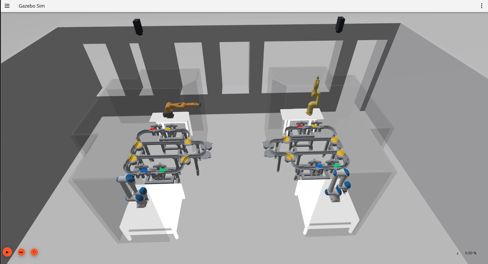

# MFJA Third-Floor ROS 2 and Gazebo Simulation

This repository provides the ROS 2 Jazzy and Gazebo Harmonic simulation of the
MFJA third floor, with a detailed Room 315 rail cell, industrial and mobile
robots, typed rail-control interfaces, and an optional neuro-symbolic
Vision-Language-Action (VLA) research stack.



*Room 315 overview with the optional industrial robot assets enabled.*

The default Room 315 rail motion is kinematic. Shuttles follow calibrated,
directed rail geometry and are moved through Gazebo pose services; wheel and
rail contact dynamics are not used to propel them.

> **Important scope:** this is a simulation and research repository. It is not
> a safety-certified controller for physical equipment. VLA task execution is
> fail-closed, disabled by default, and requires separately supplied,
> checksum-verified runtime artifacts.

**Navigation:** [installation choices](#installation-choices)
· [dependencies](#required-and-optional-dependencies)
· [native Ubuntu setup](#method-a-native-ubuntu-setup)
· [Nix setup](#method-b-hybrid-nix-setup)
· [launch profiles](#launch-profiles) · [rail controls](#rail-control-essentials)
· [robots](#robots) · [VLA workflows](#vla-and-language-to-motion-workflows)
· [troubleshooting](#fast-troubleshooting)

## Installation Choices

Both supported setup paths target Ubuntu 24.04 and produce the same four-package
colcon workspace at `$HOME/mfja_ws`. Choose one path and follow all of its
numbered steps:

| Path | What provides the build tools? | What provides ROS and Gazebo? | Best for |
| --- | --- | --- | --- |
| [Method A: native Ubuntu](#method-a-native-ubuntu-setup) | Ubuntu `apt` packages | Ubuntu `apt` packages | The shortest setup and normal simulator use |
| [Method B: hybrid Nix](#method-b-hybrid-nix-setup) | Pinned Bash, Ninja, Make, and Git from `flake.lock`; Ubuntu CMake and compiler tools | Ubuntu `apt` packages | Repeatable auxiliary tools around the supported Ubuntu ROS stack |

> **Nix boundary:** the checked-in flake is intentionally hybrid, not a pure-Nix
> ROS distribution. It does **not** install ROS 2, Gazebo, ROS package
> dependencies, CMake, GCC/G++, Python, `pkg-config`, `rosdep`, or `colcon`.
> Method B therefore installs the complete Ubuntu compiler/ROS stack before
> entering `nix develop`; Nix supplies only Bash, Ninja, Make, and Git.
> The current flake is not a supported NixOS, macOS, or Windows installation
> path.

## Required and Optional Dependencies

The base clone contains the worlds, models, meshes, URDF/SDF files, launch
files, rail configuration, and custom ROS interfaces. It has no Git submodules,
and no dataset, checkpoint, Torch installation, CUDA GPU, or external model is
needed for the first simulation run.

| Layer | Required components | Installed by |
| --- | --- | --- |
| Host platform | Ubuntu 24.04 Noble, Bash, a working OpenGL display for the GUI | Laptop/VM installation |
| ROS and simulator | ROS 2 Jazzy Desktop, Gazebo Harmonic, `ros_gz`, `robot_state_publisher` | Method A/B host `apt` step |
| Workspace tools | Git, GCC/build-essential, CMake 3.28+, Ninja, pkg-config, `mesa-utils` / `glxinfo`, colcon, rosdep, Python 3.12, pip, venv, pytest, PyYAML | Host `apt`; Method B pins only Bash, Ninja, Make, and Git with Nix |
| Package build interfaces | `ament_cmake`, ROSIDL generators/runtime, Gazebo vendor libraries (`gz-common5`, `gz-msgs10`, `gz-plugin2`, `gz-sim8`, `gz-transport13`) | `rosdep` |
| ROS runtime | `rclpy`, launch/launch_ros, standard ROS messages, `cv_bridge`, `message_filters`, `robot_state_publisher`, `ros_gz_bridge`, `ros_gz_interfaces`, `ros_gz_sim`, and PlanSys2 messages/bringup/planner | `rosdep` |
| Base Python runtime | OpenCV, NumPy, Pillow, PyYAML | `rosdep` |

The four `package.xml` files are the dependency source of truth. Do not install
each ROS dependency by hand: the `rosdep install` command in both methods
resolves the correct Jazzy/Noble package names and installs anything that is
missing.

These components are optional and must not block the base installation:

- Torch and TorchVision are needed only for learned visual inference, training,
  and Torch-gated tests. Both setup paths intentionally skip their rosdep keys.
- CUDA and a discrete GPU are optional; basic simulation and rail control work
  without them.
- The local English intent model needs `llama-cpp-python` and a separately
  downloaded GGUF file.
- LeRobot is needed only for the optional dataset export tool.
- V4 execution requires external checksum-verified datasets, checkpoints, a
  promotion bundle, and a local authorization file. These are not in Git.

See [Optional Feature Requirements](docs/INSTALLATION.md#optional-feature-requirements)
before installing any of these extras.

## Method A: Native Ubuntu Setup

This is the supported end-to-end path from a new machine to a running Room 315
simulation. The commands use Bash and a dedicated workspace at
`$HOME/mfja_ws`. Run each numbered step in order. Commands marked as one-time
setup do not need to be repeated after the machine is configured.

### 1. Confirm the Supported Environment

The maintained combination is:

| Component | Supported version |
| --- | --- |
| Operating system | Ubuntu 24.04 (Noble) |
| ROS | ROS 2 Jazzy |
| Simulator | Gazebo Harmonic through `ros_gz` |
| Python | Python 3.12 |
| CMake | 3.28 or newer |

Check the Ubuntu version before continuing:

```bash
grep -E '^(NAME|VERSION_ID)=' /etc/os-release
```

The steps below are maintained for native Ubuntu 24.04, not Ubuntu 22.04,
ROS 2 Humble, Gazebo Classic, Windows, or macOS. A virtual machine may work with
adequate resources and 3D acceleration, but it is not a validated target. The
Gazebo GUI needs a working OpenGL display.

The base smoke test does **not** require a GPU, Torch, a dataset, or a trained
model. A clean clone provides the Gazebo worlds, robots, rail runtime, typed ROS
interfaces, and basic VLA camera/supervisor processes. Active learned V4
inference and language-to-motion execution require external verified artifacts
and are intentionally not enabled by this quick start.

### 2. Install ROS 2, Gazebo, and Build Tools (One Time)

The block below updates Ubuntu, adds the official ROS apt source only when
`ros-jazzy-desktop` is not already available, and installs the complete base
tool set. It runs in a fail-fast subshell: an error stops the block without
closing the user's terminal. The
[official ROS 2 Jazzy installation page](https://docs.ros.org/en/jazzy/Installation/Ubuntu-Install-Debs.html)
is authoritative if its repository setup changes.

```bash
(
  set -euo pipefail

  . /etc/os-release
  MFJA_UBUNTU_CODENAME="${UBUNTU_CODENAME:-${VERSION_CODENAME:-}}"
  test "$MFJA_UBUNTU_CODENAME" = "noble"

  sudo apt update
  sudo apt upgrade
  sudo apt install -y \
    ca-certificates \
    curl \
    locales \
    software-properties-common

  if ! locale | grep -qi 'utf-8'; then
    sudo locale-gen en_US en_US.UTF-8
    sudo update-locale LC_ALL=en_US.UTF-8 LANG=en_US.UTF-8
    export LANG=en_US.UTF-8
    export LC_ALL=en_US.UTF-8
  fi

  sudo add-apt-repository -y universe

  if ! apt-cache show ros-jazzy-desktop >/dev/null 2>&1; then
    MFJA_ROS_APT_SOURCE_VERSION="$(
      curl -fsSL \
        https://api.github.com/repos/ros-infrastructure/ros-apt-source/releases/latest \
        | sed -n 's/.*"tag_name":[[:space:]]*"\([^"]*\)".*/\1/p'
    )"

    test -n "$MFJA_ROS_APT_SOURCE_VERSION"

    MFJA_ROS_APT_DEB="$(mktemp --suffix=.deb)"
    trap 'rm -f -- "$MFJA_ROS_APT_DEB"' EXIT
    curl -fL -o "$MFJA_ROS_APT_DEB" \
      "https://github.com/ros-infrastructure/ros-apt-source/releases/download/${MFJA_ROS_APT_SOURCE_VERSION}/ros2-apt-source_${MFJA_ROS_APT_SOURCE_VERSION}.${MFJA_UBUNTU_CODENAME}_all.deb"
    sudo dpkg -i "$MFJA_ROS_APT_DEB"
  fi

  sudo apt update
  apt-cache show ros-jazzy-desktop >/dev/null
  sudo apt install -y \
    build-essential \
    cmake \
    git \
    mesa-utils \
    ninja-build \
    pkg-config \
    python3-dev \
    python3-colcon-common-extensions \
    python3-pip \
    python3-pytest \
    python3-rosdep \
    python3-venv \
    python3-yaml \
    ros-jazzy-desktop \
    ros-jazzy-robot-state-publisher \
    ros-jazzy-ros-gz

  printf 'MFJA host setup completed successfully.\n'
)
```

Do not continue unless the block prints `MFJA host setup completed
successfully`.

### 3. Reboot the Laptop Manually (One Time)

Nothing in Step 2 restarts the laptop automatically. This is a separate,
user-initiated checkpoint so that a reboot never happens unexpectedly. Save
your work and close any applications when you are ready. The following command
immediately ends the current desktop session and restarts the laptop:

```bash
sudo reboot
```

If you are not ready to restart, stop here and return to this step later. Do not
continue to Step 4 until the reboot has completed. After login, open a new
terminal in the local graphical desktop and continue with Step 4; do not repeat
Step 2.

This checkpoint is important after a kernel or NVIDIA driver update. Until the
reboot, the loaded kernel driver can differ from the newly installed graphics
libraries, causing `nvidia-smi`, `glxinfo`, and Gazebo to fail even though the
project itself is installed correctly. The
[official Ubuntu NVIDIA driver guide](https://ubuntu.com/server/docs/how-to/graphics/install-nvidia-drivers/)
also requires a reboot after updating the system and kernel.

### 4. Verify the Host Tools and Graphics After Reboot

If the original terminal did not already use UTF-8, apply the generated locale
to that terminal as well. A new login shell receives it automatically:

```bash
if ! locale | grep -qi 'utf-8'; then
  export LANG=en_US.UTF-8
  export LC_ALL=en_US.UTF-8
fi
```

Initialize `rosdep` once per machine, then verify the host tools:

```bash
(
  set -eo pipefail

  if [ ! -e /etc/ros/rosdep/sources.list.d/20-default.list ]; then
    sudo rosdep init
  fi
  rosdep update

  source /opt/ros/jazzy/setup.bash
  echo "$ROS_DISTRO"
  gz sim --versions
  cmake --version
  python3 --version

  if [ -z "${DISPLAY:-}" ]; then
    printf 'ERROR: run this GUI preflight from the local graphical desktop.\n' >&2
    exit 1
  fi

  MFJA_GLX_INFO="$(LC_ALL=C glxinfo -B)"
  printf '%s\n' "$MFJA_GLX_INFO"
  grep -Fq 'direct rendering: Yes' <<<"$MFJA_GLX_INFO"
  grep -Eq '^OpenGL (core profile )?version string:' <<<"$MFJA_GLX_INFO"

  if command -v nvidia-smi >/dev/null 2>&1; then
    nvidia-smi --query-gpu=name,driver_version --format=csv,noheader
  fi
)
```

Expected results are `jazzy`, the Gazebo Harmonic / `gz-sim8` generation,
CMake 3.28 or newer, Python 3.12, `direct rendering: Yes`, and an OpenGL version
above 3.3 (4.3 or newer is preferred). On a normal Mesa-only laptop,
`nvidia-smi` is absent and is skipped. If NVIDIA utilities are installed, their
query must succeed without `Driver/library version mismatch`.

Finally, test the same Qt/Ogre2 rendering path used by the simulator before
cloning or building this project:

```bash
source /opt/ros/jazzy/setup.bash
gz sim --force-version 8 -v 4 shapes.sdf
```

The Gazebo 3D window must open and render the shapes. Stop it with `Ctrl-C`,
then continue to Step 5. If this stock world fails, stop here and fix the host
graphics/session first; deleting the workspace or rebuilding the project cannot
repair it. The standard laptop path intentionally performs this check in a
local graphical session. A truly headless machine instead needs a separately
validated EGL setup; `gui:=false` alone is not sufficient because project
cameras still require server-side rendering.

### 5. Create the Workspace and Clone the Repository

The normal clone follows GitHub's default branch. During the current integration
window, the documented runtime may still be on
`INTERNSHIP-ALI-2026`; the marker check below switches to that branch
only when the default branch does not contain the current launch stack. After
the merge, the same block remains on `main` without requiring an edit.

```bash
(
  set -euo pipefail

  MFJA_WS="$HOME/mfja_ws"
  MFJA_REPO="$MFJA_WS/src/mfja_3rd_floor_gz"

  mkdir -p "$MFJA_WS/src"
  git clone \
    https://github.com/aip-primeca-occitanie/mfja_3rd_floor_gz.git \
    "$MFJA_REPO"

  if [ ! -f "$MFJA_REPO/docs/INSTALLATION.md" ] ||
     [ ! -f "$MFJA_REPO/mfja_3rd_floor_bringup/launch/room_315_floor_common.py" ]; then
    git -C "$MFJA_REPO" switch --track \
      origin/INTERNSHIP-ALI-2026
  fi

  test -f "$MFJA_REPO/docs/INSTALLATION.md"
  test -f "$MFJA_REPO/mfja_3rd_floor_bringup/launch/room_315_floor_common.py"
  git -C "$MFJA_REPO" status --short --branch
)
```

The last command prints `INTERNSHIP-ALI-2026` before the integration
merge and `main` after it. If the repository already exists at
`$HOME/mfja_ws/src/mfja_3rd_floor_gz`, do not clone over it; use the
[update procedure](docs/INSTALLATION.md#updating-an-existing-checkout).

### 6. Install Repository Dependencies

Source ROS first, then let `rosdep` resolve the four ROS packages in this
meta-repository:

```bash
(
  set -eo pipefail

  MFJA_WS="$HOME/mfja_ws"
  MFJA_REPO="$MFJA_WS/src/mfja_3rd_floor_gz"
  source /opt/ros/jazzy/setup.bash

  rosdep install --from-paths \
    "$MFJA_REPO/mfja_3rd_floor_bringup" \
    "$MFJA_REPO/mfja_3rd_floor_description" \
    "$MFJA_REPO/mfja_rail_interfaces" \
    "$MFJA_REPO/mfja_robot_control_config" \
    --ignore-src --rosdistro jazzy -y \
    --skip-keys "python3-torch python3-torchvision"

  rosdep check --from-paths \
    "$MFJA_REPO/mfja_3rd_floor_bringup" \
    "$MFJA_REPO/mfja_3rd_floor_description" \
    "$MFJA_REPO/mfja_rail_interfaces" \
    "$MFJA_REPO/mfja_robot_control_config" \
    --ignore-src --rosdistro jazzy \
    --skip-keys "python3-torch python3-torchvision"
)
```

Torch and TorchVision are skipped because they are optional for the base
simulation and may not have installable apt candidates. Install them later in
an isolated environment only if you need learned visual inference, training,
or the Torch-gated tests.

### 7. Build and Verify the Workspace

Build from the workspace root, not from the repository directory:

```bash
(
  set -eo pipefail

  MFJA_WS="$HOME/mfja_ws"
  MFJA_REPO="$MFJA_WS/src/mfja_3rd_floor_gz"
  cd "$MFJA_WS"
  source /opt/ros/jazzy/setup.bash

  colcon build --symlink-install --paths \
    "$MFJA_REPO/mfja_rail_interfaces" \
    "$MFJA_REPO/mfja_3rd_floor_description" \
    "$MFJA_REPO/mfja_robot_control_config" \
    "$MFJA_REPO/mfja_3rd_floor_bringup"

  source "$MFJA_WS/install/setup.bash"

  ros2 pkg prefix mfja_3rd_floor_bringup
  ros2 pkg prefix mfja_3rd_floor_description
  ros2 pkg prefix mfja_rail_interfaces
  ros2 pkg prefix mfja_robot_control_config
  ros2 interface show mfja_rail_interfaces/msg/ShuttleCommand
  ros2 launch mfja_3rd_floor_bringup room_315_only.launch.py --show-args
)
```

The build is successful only when the final colcon summary reports no failed
packages and every verification command completes. All package prefixes should
point inside `$HOME/mfja_ws/install`. Explicit package
paths are used during dependency resolution and building so datasets or frozen
source snapshots elsewhere on the machine are not discovered as duplicate
colcon packages.

### 8. Start Room 315 (Terminal 1)

This lightweight profile disables the heavier robot models, starts Gazebo
unpaused, and creates one visible right-rail shuttle in the stopped state:

```bash
export MFJA_WS="$HOME/mfja_ws"
source /opt/ros/jazzy/setup.bash
source "$MFJA_WS/install/setup.bash"

ros2 launch mfja_3rd_floor_bringup room_315_only.launch.py \
  robots:=none \
  gui:=true \
  start_paused:=false \
  enable_room315_kinematic_shuttles:=true \
  room315_right_shuttle_count:=1 \
  room315_left_shuttle_count:=0 \
  room315_shuttles_start_enabled:=false
```

Leave this terminal running. Gazebo starts first and the rail nodes are added
after about four seconds. Wait about five seconds before running the checks in
Terminal 2; slower machines may need longer.

### 9. Verify the Runtime and Move the Shuttle (Terminal 2)

Open a second terminal and source the same environments again:

```bash
export MFJA_WS="$HOME/mfja_ws"
source /opt/ros/jazzy/setup.bash
source "$MFJA_WS/install/setup.bash"

ros2 topic echo --once /clock
ros2 topic list | grep '^/room_315/rails/'
ros2 service list | grep '^/world/room_315_only/'
ros2 topic echo --once /room_315/rails/right/shuttles/state \
  mfja_rail_interfaces/msg/ShuttleState
```

The service list should include `create`, `remove`, and `set_pose` under
`/world/room_315_only/`.

Before the motion command, the shuttle state should contain
`name: room315_right_shuttle_1` and `mode: DISABLED`. Start it with:

```bash
ros2 topic pub --once /room_315/rails/right/shuttles/command \
  mfja_rail_interfaces/msg/ShuttleCommand \
  "{name: 'room315_right_shuttle_1', command: 'ON', speed: 0.2}"

ros2 topic echo --once /room_315/rails/right/shuttles/state \
  mfja_rail_interfaces/msg/ShuttleState
```

In this default one-shuttle exterior-route configuration, the next state should
be `MOVING`, and the shuttle should move in the Gazebo window. If the mode
remains `DISABLED`, first confirm that Terminal 2 was sourced and that the
command topic has a subscriber. If it becomes `WAITING`, inspect the stopper
state and shuttle spacing.

When you are ready to stop only the shuttle, publish `OFF`:

```bash
ros2 topic pub --once /room_315/rails/right/shuttles/command \
  mfja_rail_interfaces/msg/ShuttleCommand \
  "{name: 'room315_right_shuttle_1', command: 'OFF'}"
```

Stop the simulation with `Ctrl-C` in Terminal 1 before starting another launch
profile.

### 10. Source Every New Terminal

Opening a new terminal does not preserve the ROS environment. Run these lines
before every `ros2` command:

```bash
export MFJA_WS="$HOME/mfja_ws"
export MFJA_REPO="$MFJA_WS/src/mfja_3rd_floor_gz"
source /opt/ros/jazzy/setup.bash
source "$MFJA_WS/install/setup.bash"
```

If `ros2 pkg prefix mfja_3rd_floor_bringup` fails, the workspace was not built,
the build failed, or the wrong `install/setup.bash` was sourced.

### Server-Only First Run

Set `gui:=false` to suppress the Gazebo client while keeping the simulation
server running:

```bash
ros2 launch mfja_3rd_floor_bringup room_315_only.launch.py \
  robots:=none \
  gui:=false \
  start_paused:=false \
  enable_room315_kinematic_shuttles:=true \
  room315_right_shuttle_count:=1 \
  room315_left_shuttle_count:=0 \
  room315_shuttles_start_enabled:=false
```

Use the Terminal 2 checks above to prove that the server-only simulation is
running. This option does not guarantee display-free operation on every CI/SSH
host: the world contains RGB-D cameras, so Gazebo can still need a working
EGL/headless rendering backend. For low-memory builds, proxy/offline setup,
optional Torch, and installation failures, read the full
[Installation Guide](docs/INSTALLATION.md).

## Method B: Hybrid Nix Setup

Follow N1 through N9 in order for a new laptop. This method gives developers
pinned Bash, Ninja, Make, and Git while deliberately using Ubuntu CMake,
GCC/G++, Python, `pkg-config`, colcon, ROS 2 Jazzy, and Gazebo Harmonic as one
ABI-compatible host toolchain. The first `nix develop` needs network access
and downloads packages into `/nix/store`; later entries reuse that store and
the checked-in `flake.lock`. The lock file pins the auxiliary Nix tools only;
Ubuntu CMake, the compiler, and ROS/Gazebo apt packages are not pinned by the
flake, so this is not a fully reproducible ROS distribution.

### N1. Confirm the Host Platform

The supported Nix path is the same Ubuntu 24.04 Linux host as Method A. The
flake declares `x86_64-linux` and `aarch64-linux`, although Gazebo on ARM is a
best-effort target; Ubuntu on `x86_64` is the safest choice. The flake does not
provide a Windows or macOS shell.

```bash
grep -E '^(NAME|VERSION_ID)=' /etc/os-release
uname -m
```

Do not continue with this guide unless the Ubuntu version is `24.04` and the
architecture is `x86_64` or `aarch64`. Expect to validate simulator rendering
locally when using `aarch64`.

### N2. Install the Host ROS/Gazebo Runtime

On a clean laptop, complete
[Method A, Steps 2 through 4](#2-install-ros-2-gazebo-and-build-tools-one-time)
exactly as written. Those steps install and validate the host components that
Nix does not provide:

- ROS 2 Jazzy Desktop and `/opt/ros/jazzy/setup.bash`;
- Gazebo Harmonic and the `ros_gz` packages;
- `/usr/bin/cmake`, `/usr/bin/gcc`, `/usr/bin/g++`, `/usr/bin/python3`, and
  `/usr/bin/pkg-config` from Ubuntu;
- `/usr/bin/colcon`, `rosdep`, and the Ubuntu Python/ROS integration;
- the initial `rosdep` database.

Method A Step 3 is a separate, manually initiated reboot, and Step 4 contains
the post-reboot OpenGL/Gazebo smoke test. Do not enter `nix develop` until both
are complete; Nix cannot repair or replace the host kernel graphics driver.

Verify this boundary before installing Nix:

```bash
test -f /opt/ros/jazzy/setup.bash
test -x /usr/bin/colcon
test -x /usr/bin/cmake
test -x /usr/bin/gcc
test -x /usr/bin/g++
test -x /usr/bin/python3
test -x /usr/bin/pkg-config

source /opt/ros/jazzy/setup.bash
test "$ROS_DISTRO" = jazzy
gz sim --versions
```

If any `test` command fails, return to the relevant host setup or verification
step in Method A Steps 2 through 4. Entering the Nix shell cannot repair a
missing Ubuntu tool, ROS installation, or graphics driver.

### N3. Install Nix (One Time)

The following is the official recommended multi-user installer for a Linux
machine using systemd. It downloads and executes the Nix installer, creates
`/nix`, and configures the Nix daemon, so inspect the
[official Nix download page](https://nixos.org/download/) first if required by
your system policy:

```bash
sudo apt update
sudo apt install -y ca-certificates curl xz-utils

curl --proto '=https' --tlsv1.2 -L \
  https://nixos.org/nix/install \
  | sh -s -- --daemon
```

When the installer finishes, close the terminal and open a new one so its Nix
profile is loaded. Then verify the command:

```bash
nix --version
```

Do not run the installer with `sudo`; the script requests elevated permission
itself when configuring the multi-user daemon.

### N4. Enable Flake Commands (One Time)

Nix flakes remain an opt-in feature. Preserve any existing Nix configuration
and add the setting only when it is not already present:

```bash
MFJA_NIX_CONF="$HOME/.config/nix/nix.conf"
mkdir -p "$(dirname "$MFJA_NIX_CONF")"
touch "$MFJA_NIX_CONF"

if ! grep -Eq \
  '^[[:space:]]*(extra-)?experimental-features[[:space:]]*=.*nix-command.*flakes' \
  "$MFJA_NIX_CONF"; then
  printf '%s\n' \
    'extra-experimental-features = nix-command flakes' \
    >> "$MFJA_NIX_CONF"
fi

nix flake --help >/dev/null
```

If local policy does not permit changing `nix.conf`, leave it unchanged and add
`--extra-experimental-features 'nix-command flakes'` to each `nix` command
below.

### N5. Create the Workspace and Clone the Project

Nix does not download or clone the project repository. On a new laptop, run
this step before installing the ROS package dependencies or entering the Nix
shell:

```bash
export MFJA_WS="$HOME/mfja_ws"
export MFJA_REPO="$MFJA_WS/src/mfja_3rd_floor_gz"

(
  set -euo pipefail

  mkdir -p "$MFJA_WS/src"

  if [ ! -e "$MFJA_REPO" ]; then
    git clone \
      https://github.com/aip-primeca-occitanie/mfja_3rd_floor_gz.git \
      "$MFJA_REPO"
  fi

  test "$(git -C "$MFJA_REPO" rev-parse --is-inside-work-tree)" = true

  if [ ! -f "$MFJA_REPO/docs/INSTALLATION.md" ] ||
     [ ! -f "$MFJA_REPO/mfja_3rd_floor_bringup/launch/room_315_floor_common.py" ]; then
    git -C "$MFJA_REPO" switch --track \
      origin/INTERNSHIP-ALI-2026
  fi

  test -f "$MFJA_REPO/flake.nix"
  test -f "$MFJA_REPO/flake.lock"
  test -f "$MFJA_REPO/docs/INSTALLATION.md"
  test -f "$MFJA_REPO/mfja_3rd_floor_bringup/launch/room_315_floor_common.py"
  git -C "$MFJA_REPO" status --short --branch
)
```

The block clones the repository when it is missing and reuses a valid existing
checkout. It selects `INTERNSHIP-ALI-2026` only while the documented
runtime is not yet available from GitHub's default branch.

Do not run `nix flake update` during normal installation. The committed lock
file is what pins the development environment used by the project.

### N6. Install the ROS Package Dependencies

Nix does not replace rosdep. Complete
[Method A, Step 6](#6-install-repository-dependencies) before entering the
development shell. It installs the package-manifest dependencies and checks
them while skipping only the optional Torch/TorchVision keys.

The last line from `rosdep check` must be:

```text
All system dependencies have been satisfied
```

### N7. Inspect and Enter the Pinned Build-Tool Shell

Evaluate the committed flake, then enter its default shell:

```bash
cd "$MFJA_REPO"
nix flake show
nix develop
```

The first entry can take several minutes while Nix downloads the pinned
packages. Inside the new shell, verify both halves of the hybrid environment:

```bash
(
  set -euo pipefail

  test "$MFJA_NIX_MODE" = hybrid
  test "$ROS_DISTRO" = jazzy
  test -x /usr/bin/colcon

  test "$CC" = /usr/bin/gcc
  test "$CXX" = /usr/bin/g++
  test "$PKG_CONFIG" = /usr/bin/pkg-config
  test "$PYTHON" = /usr/bin/python3
  test "$(command -v cmake)" = /usr/bin/cmake
  test "$(command -v gcc)" = /usr/bin/gcc
  test "$(command -v g++)" = /usr/bin/g++
  test "$(command -v python3)" = /usr/bin/python3
  test "$(command -v pkg-config)" = /usr/bin/pkg-config
  test "$(command -v colcon)" = /usr/bin/colcon
  test -z "${NIX_CFLAGS_COMPILE:-}"
  test -z "${NIXPKGS_CMAKE_PREFIX_PATH:-}"

  MFJA_CMAKE_VERSION="$(/usr/bin/cmake --version | \
    /usr/bin/awk 'NR == 1 { print $3 }')"
  /usr/bin/dpkg --compare-versions "$MFJA_CMAKE_VERSION" ge 3.28
  printf 'Ubuntu CMake version: %s\n' "$MFJA_CMAKE_VERSION"
  unset MFJA_CMAKE_VERSION

  for MFJA_NIX_TOOL in ninja git make; do
    case "$(command -v "$MFJA_NIX_TOOL")" in
      /nix/store/*/bin/*) ;;
      *) printf 'ERROR: %s is not coming from Nix.\n' \
           "$MFJA_NIX_TOOL" >&2; false ;;
    esac
  done
  unset MFJA_NIX_TOOL
  command -v ros2
  command -v gz

  /usr/bin/pkg-config --exists uuid
  /usr/bin/pkg-config --atleast-version=4 libzmq
  test -f /usr/include/zmq.hpp
  test -f /usr/include/python3.12/Python.h
  test -f "/usr/include/$(/usr/bin/gcc -print-multiarch)/python3.12/pyconfig.h"
  printf '%s\n' \
    '#include <Python.h>' \
    '#include <cstdlib>' \
    '#include <ctime>' \
    '#include <sys/types.h>' \
    'int main() { std::time_t value{}; return static_cast<int>(value); }' | \
    /usr/bin/g++ -std=c++17 -x c++ -fsyntax-only \
      -I/usr/include/python3.12 -

  printf 'MFJA_NIX_MODE=%s\n' "$MFJA_NIX_MODE"
  printf 'ROS_DISTRO=%s\n' "$ROS_DISTRO"
)
```

The shell supplies Bash, Ninja, Make, and Git from Nix. Its shell hook removes
inherited workspace overlays and Nix compiler flags, creates a controlled path
that selects the exact Ubuntu CMake, GCC/G++, Python, `pkg-config`, colcon, and
binutils executables, then sources `/opt/ros/jazzy/setup.bash` and defaults
`RMW_IMPLEMENTATION` to `rmw_fastrtps_cpp`. This keeps Ubuntu headers, glibc,
CMake, compiler, Python, ROS, and Gazebo on the same ABI boundary while
retaining the pinned ABI-neutral Nix utilities.

### N8. Build and Verify Inside the Nix Shell

Stay inside `nix develop`, move to the workspace root, and build only the four
repository packages:

```bash
cd "$MFJA_WS"

if colcon build --symlink-install --paths \
    "$MFJA_REPO/mfja_rail_interfaces" \
    "$MFJA_REPO/mfja_3rd_floor_description" \
    "$MFJA_REPO/mfja_robot_control_config" \
    "$MFJA_REPO/mfja_3rd_floor_bringup" \
    --cmake-args \
    -DCMAKE_C_COMPILER=/usr/bin/gcc \
    -DCMAKE_CXX_COMPILER=/usr/bin/g++ \
    -DPython3_EXECUTABLE=/usr/bin/python3; then
  source "$MFJA_WS/install/setup.bash"

  ros2 pkg prefix mfja_3rd_floor_bringup
  ros2 pkg prefix mfja_3rd_floor_description
  ros2 pkg prefix mfja_rail_interfaces
  ros2 pkg prefix mfja_robot_control_config
  ros2 interface show mfja_rail_interfaces/msg/ShuttleCommand
  ros2 launch mfja_3rd_floor_bringup room_315_only.launch.py --show-args
else
  printf '%s\n' \
    'ERROR: colcon build failed; the install overlay was not sourced.' \
    'Fix the build error before sourcing $MFJA_WS/install/setup.bash.' >&2
  false
fi
```

Every package prefix must point inside `$MFJA_WS/install`. On a low-memory
machine, repeat the build with `--executor sequential` immediately after
`--symlink-install`.

After the successful build, confirm that CMake recorded the Ubuntu compilers:

```bash
grep -Eq '^CMAKE_C_COMPILER:(FILEPATH|STRING)=/usr/bin/gcc$' \
  "$MFJA_WS/build/mfja_3rd_floor_description/CMakeCache.txt"
grep -Eq '^CMAKE_CXX_COMPILER:(FILEPATH|STRING)=/usr/bin/g\+\+$' \
  "$MFJA_WS/build/mfja_3rd_floor_description/CMakeCache.txt"
grep -Eq '^Python3_EXECUTABLE:(FILEPATH|STRING|UNINITIALIZED)=/usr/bin/python3$' \
  "$MFJA_WS/build/mfja_3rd_floor_description/CMakeCache.txt"
```

### N9. Run the Simulation from Nix

In Terminal 1, enter the Nix shell, source the built overlay, and launch the
same lightweight Room 315 profile used by Method A:

```bash
export MFJA_WS="$HOME/mfja_ws"
export MFJA_REPO="$MFJA_WS/src/mfja_3rd_floor_gz"
cd "$MFJA_REPO"
nix develop
```

Inside the Nix shell:

```bash
source "$MFJA_WS/install/setup.bash"
ros2 launch mfja_3rd_floor_bringup room_315_only.launch.py \
  robots:=none \
  gui:=true \
  start_paused:=false \
  enable_room315_kinematic_shuttles:=true \
  room315_right_shuttle_count:=1 \
  room315_left_shuttle_count:=0 \
  room315_shuttles_start_enabled:=false
```

Leave Terminal 1 running. In Terminal 2, enter a second Nix shell and source the
same overlay:

```bash
export MFJA_WS="$HOME/mfja_ws"
export MFJA_REPO="$MFJA_WS/src/mfja_3rd_floor_gz"
cd "$MFJA_REPO"
nix develop
```

Inside the second Nix shell:

```bash
source "$MFJA_WS/install/setup.bash"
ros2 topic echo --once /clock
ros2 topic echo --once /room_315/rails/right/shuttles/state \
  mfja_rail_interfaces/msg/ShuttleState
```

Use the ON/OFF commands in
[Method A, Step 9](#9-verify-the-runtime-and-move-the-shuttle-terminal-2) to
prove shuttle motion. Stop the launch with `Ctrl-C`; run `exit` in each terminal
when you want to leave its Nix shell.

For every later terminal, the required order is: set `MFJA_WS`/`MFJA_REPO`,
`cd "$MFJA_REPO"`, run `nix develop`, then source
`$MFJA_WS/install/setup.bash`. If `nix develop` warns that
`/opt/ros/jazzy/setup.bash` or `/usr/bin/colcon` is missing, fix the host setup
from N2 rather than trying to add those packages to the current shell.

## Where to Go Next

| Goal | Guide |
| --- | --- |
| Try rail switches, stoppers, sensors, payloads, and robots | [Quick Start and Feature Guide](docs/QUICK_START_AND_FEATURE_GUIDE.md) |
| Understand packages, runtime processes, and data flow | [System Architecture](docs/SYSTEM_ARCHITECTURE.md) |
| Change robots, worlds, rail geometry, sensors, or VLA settings | [Configuration and Customization](docs/CONFIGURATION.md) |
| Find the full rail topic, message, and service API | [Room 315 Rail Reference](docs/ROOM315_RAIL_REFERENCE.md) |
| Maintain, test, and extend the repository | [Maintenance Guide](docs/MAINTENANCE.md) |
| Diagnose a build or runtime problem | [Troubleshooting](docs/TROUBLESHOOTING.md) |
| Browse every user, operator, research, and maintainer document | [Documentation Hub](docs/README.md) |
| Look up project terminology | [Glossary](docs/GLOSSARY.md) |

## What the Repository Contains

- Room 315 and complete third-floor Gazebo worlds.
- Kinematic right- and left-rail shuttle fleets with four public shuttle
  identities per side.
- Configurable switches, stoppers, indexing sensors, approach sensors, payload
  visuals, collision spacing, and runtime shuttle creation/removal.
- Typed ROS 2 messages and services under
  `/room_315/rails/{right,left}/...`.
- KUKA KR6, Staeubli TX2, Yaskawa HC10/HC10DT, and TIAGo simulation assets.
- Joint and industrial-gripper command helpers.
- Independent overhead RGB-D cameras for the Room 315 rail sides.
- Dataset capture, validation, splitting, training, evaluation, benchmark, and
  evidence tooling.
- English task-goal parsing, visual-state inference, PlanSys2 planning, a
  supervised primitive-action boundary, and closed-loop re-observation.

The principal limitations are documented in
[System Architecture: Scope and Boundaries](docs/SYSTEM_ARCHITECTURE.md#scope-and-boundaries).

## Launch Profiles

| Profile | Command | Default behavior |
| --- | --- | --- |
| Room 315 only | `ros2 launch mfja_3rd_floor_bringup room_315_only.launch.py` | GUI on, simulation running, rails enabled, zero initial shuttles, robots selected from the Room 315 YAML unless `robots:=none` is passed |
| Complete third floor | `ros2 launch mfja_3rd_floor_bringup full_floor.launch.py` | GUI on, simulation paused, rails enabled, zero initial shuttles, robots selected from the full-floor YAML |
| One industrial robot | `ros2 launch mfja_3rd_floor_bringup single_industrial_robot.launch.py robot:=kuka` | Minimal world with one robot and its table; selectors are `kuka`, `staubli`, `hc10`, and `hc10dt` |
| Server-only Room 315 | Add `gui:=false start_paused:=false robots:=none` | Gazebo client disabled; camera sensors can still require a working headless-rendering backend |
| Room 315 with VLA bridge/supervisor | Add `enable_room315_vla:=true` | Camera bridge and primitive supervisor enabled; learned visual inference and task execution remain separate processes |

Inspect the authoritative arguments and current defaults from the installed
launch file:

```bash
ros2 launch mfja_3rd_floor_bringup room_315_only.launch.py --show-args
```

Only one high-level Room 315 or full-floor launch may run on a host at a time.
These launches own an exclusive runtime lock because their ROS topics and
Gazebo world services are process-global. Stop the first launch with `Ctrl-C`
before starting another.

Every high-level Room 315/full-floor launch clears the disposable obstacle-pose
cache at `~/.ros/room315_vla_obstacles.json` by default. Preserve it with
`room315_clear_vla_obstacle_pose_cache:=false`. If you override
`room315_vla_obstacle_pose_file`, point it only at the intended cache file: the
default startup action unlinks that configured path.

## Rail Control Essentials

Right-rail examples are shown below. Replace `right` with `left` for the other
rail.

### Shuttle Commands

```bash
# Stop, reset to the configured start position, or remove a shuttle.
ros2 topic pub --once /room_315/rails/right/shuttles/command \
  mfja_rail_interfaces/msg/ShuttleCommand \
  "{name: 'room315_right_shuttle_1', command: 'OFF'}"

ros2 topic pub --once /room_315/rails/right/shuttles/command \
  mfja_rail_interfaces/msg/ShuttleCommand \
  "{name: 'room315_right_shuttle_1', command: 'RESET'}"

ros2 topic pub --once /room_315/rails/right/shuttles/command \
  mfja_rail_interfaces/msg/ShuttleCommand \
  "{name: 'room315_right_shuttle_1', command: 'REMOVE'}"
```

Add a shuttle at runtime:

```bash
ros2 service call /room_315/rails/right/shuttles/add \
  mfja_rail_interfaces/srv/AddShuttle \
  "{name: 'room315_right_shuttle_2', start_slot: '1', speed: 0.2, start_enabled: false}"
```

### Switches and Stoppers

Switch state `E`/`EXTERIOR` selects the exterior branch;
`I`/`INTERIOR` selects the interior branch. Stopper state `0` is open/pass and
`1` is closed/stop.

Switches form coordinated pairs: `A1`/`A2` and `A3`/`A4`. The typed command
topic is a low-level simulation interface and bypasses the VLA route-planning
boundary. Use it to move a route only on an empty rail. Normal numbered start
slots lie on exterior guard segments, so resetting a shuttle there is not safe
preparation for an interior route. For this switch-only example, stop the prior
launch and restart it with both shuttle counts set to `0`. Never reroute a
moving shuttle after a fixed timer.

```bash
ros2 topic pub --once /room_315/rails/right/switches/command \
  mfja_rail_interfaces/msg/SwitchCommand \
  "{switches: [{name: 'A1', state: 'INTERIOR'}, {name: 'A2', state: 'INTERIOR'}]}"

ros2 topic pub --once /room_315/rails/right/stoppers/command \
  mfja_rail_interfaces/msg/StopperCommand \
  "{stoppers: [{name: 'A1', state: '1'}]}"
```

Commands are requests. The corresponding `.../state` topic reports the actual
state after the configured motion delay.

### Sensor Feedback

```bash
ros2 topic echo /room_315/rails/right/sensors/feedback \
  mfja_rail_interfaces/msg/SensorFeedback
```

Sensors report binary occupancy. `active: 1` means a shuttle is inside the
configured sensor radius; it is not a distance measurement. The message also
carries privileged segment/arc-length fields for debugging and evaluation;
those fields are not additional physical distance sensors and are excluded from
the learned visual-model input.

The complete operator procedure is in
[Quick Start and Feature Guide](docs/QUICK_START_AND_FEATURE_GUIDE.md), and the
full API is in [Room 315 Rail Reference](docs/ROOM315_RAIL_REFERENCE.md).

## Robots

Robot spawn lists live in:

- `mfja_robot_control_config/config/robots.yaml` for the complete floor.
- `mfja_robot_control_config/config/robots_room_315_only.yaml` for Room 315.

The current full-floor YAML enables both `tiago1` and `tiago_base1`. Mobile
topics and TF frame IDs are instance-prefixed, so both variants can run in the
same ROS graph without sharing `odom`, `base_link`, or `base_footprint` frames.
The generic `tiago` selector remains ambiguous when both entries exist; use an
exact name when selecting only one variant.

The `robots` launch argument accepts `none`, `all`, an exact robot name, a
supported unambiguous alias, a YAML list index, or a comma-separated
combination. Prefer exact names for mobile robots. Examples:

```bash
ros2 launch mfja_3rd_floor_bringup full_floor.launch.py \
  robots:=kuka1,tiago1 gui:=true start_paused:=false

ros2 run mfja_robot_control_config robot_joint_command.py --list
ros2 run mfja_robot_control_config robot_gripper_command.py --list
```

Grippers are animated symmetric mechanisms; they do not currently attach or
physically grasp payloads. See
[Full Floor and Robot Reference](docs/FULL_FLOOR_AND_ROBOTS.md).

## VLA and Language-to-Motion Workflows

The current control boundary is intentionally neuro-symbolic:

```text
confirmed English TaskGoal
  -> accepted visual facts and deterministic presence
  -> PlanSys2 problem and plan
  -> one validated primitive
  -> rail supervisor
  -> effect check, new observation, and replan
```

Learned components may propose task-goal fields or produce visual facts. They
do not publish rail commands directly. Exact simulator pose, true segment, and
binary rail signals remain outside learned visual-model input and are used only
in declared safety, presence, or evaluation boundaries.

Basic VLA camera/supervisor launch:

```bash
ros2 launch mfja_3rd_floor_bringup room_315_only.launch.py \
  robots:=none \
  gui:=true \
  start_paused:=false \
  enable_room315_vla:=true
```

Active visual inference and motion execution are not turnkey on a fresh clone.
They require an external V4 promotion manifest, the artifacts referenced by
that manifest, exact checksums, and a host-local task-execution authorization
file. The checked-in runtime YAML records a qualified project environment and
contains site-specific absolute paths; do not enable execution by merely
changing `execution_enabled`.

Read these in order for the advanced runtime:

1. [VLA Operations](docs/ROOM315_VLA_OPERATIONS.md)
2. [Visual Runtime Integration](docs/room315_visual_runtime_integration.md)
3. [Task-Goal Understanding](docs/ROOM315_TASK_GOAL_UNDERSTANDING.md)
4. [PDDL Planning](docs/ROOM315_PDDL_PLANNING.md)
5. [Language-to-Motion Runtime](docs/ROOM315_LANGUAGE_TO_MOTION_RUNTIME.md)

Dataset and checkpoint releases are described in the
[Documentation Hub](docs/README.md#datasets-models-and-evidence). Large
datasets, checkpoints, caches, and generated experiment output should remain
outside the Git working tree.

## Repository Layout

This repository is a colcon meta-repository, not a ROS package itself.

| Path | Responsibility |
| --- | --- |
| `mfja_3rd_floor_bringup/` | Stable high-level launch entry points |
| `mfja_3rd_floor_description/` | Gazebo worlds, SDF models, meshes, URDF, and the symmetric-gripper C++ plugin |
| `mfja_rail_interfaces/` | Typed Room 315 messages and the runtime shuttle-add service |
| `mfja_robot_control_config/` | Robot spawning, rail runtime, VLA/planning nodes, tools, configuration, launch files, and most tests |
| `docs/` | User, operator, architecture, maintenance, research, and audit documentation |
| `report/` | English report sources, figures, and checksum-bound evidence records |
| `flake.nix` | Optional hybrid Nix development shell |

See [System Architecture](docs/SYSTEM_ARCHITECTURE.md) for package dependencies,
launch sequencing, ROS interfaces, data ownership, and runtime files.

## Common Configuration Entry Points

| Change | Source of truth |
| --- | --- |
| Enable, disable, rename, or reposition robots | `mfja_robot_control_config/config/robots*.yaml` |
| Change industrial gripper travel/defaults | `mfja_robot_control_config/config/gripper_command_defaults.yaml` |
| Change Room 315 slots, sensors, stoppers, or radii | `mfja_robot_control_config/config/room_315_kinematics/rail_devices_{right,left}.yaml` |
| Change rail topology or segment-to-CSV mapping | `mfja_robot_control_config/config/room_315_kinematics/rail_network_{right,left}.yaml` |
| Change measured rail geometry | `mfja_robot_control_config/config/room_315_kinematics/raw_segments/*.csv` |
| Change a world or model | `mfja_3rd_floor_description/worlds/` or `models/` |
| Change launch defaults and feature wiring | `mfja_3rd_floor_bringup/launch/room_315_floor_common.py` |
| Change shuttle identity/color mapping | `mfja_robot_control_config/config/room_315_vla/shuttle_identity.yaml` |
| Change supervisor defaults | `mfja_robot_control_config/config/room_315_vla/vla_supervisor.yaml` |
| Change visual-runtime or execution policy | `mfja_robot_control_config/config/room_315_vla/*.yaml`, preserving the artifact and authorization contracts |

Before editing any of these files, use
[Configuration and Customization](docs/CONFIGURATION.md), which explains the
required companion changes, validation, rebuild, and restart for each case.

## Development and Verification

Documentation-only changes do not require a ROS rebuild. Source, launch,
interface, model, world, and installed configuration changes do.

Typical checks from the repository root are:

```bash
git diff --check
python3 -m pytest mfja_3rd_floor_description/test
python3 -m pytest \
  mfja_robot_control_config/test/test_room315_kinematic_shuttle_core.py
```

The full direct control-package collection requires the optional Torch
environment; without Torch, module-level dependency guards can make collection
exit with "no tests collected." See the Maintenance Guide for the focused and
full matrices.

After a colcon build:

```bash
cd "$MFJA_WS"
source /opt/ros/jazzy/setup.bash
source "$MFJA_WS/install/setup.bash"
colcon test --packages-select \
  mfja_3rd_floor_description \
  mfja_robot_control_config
colcon test-result --verbose
```

The control package has a large research test suite, and optional Torch-backed
tests are registered only when Torch is importable at CMake configure time.
Start with a focused test for the component you changed, then run the package or
full suite before merging. Direct `pytest` and `colcon test` cover different
sets, so use the matrix in [Maintenance Guide](docs/MAINTENANCE.md).

## Fast Troubleshooting

- `Package ... not found`: build from the workspace root and source the same
  workspace's `install/setup.bash` in the current terminal.
- `nix: command not found` immediately after installation: close the terminal
  and open a new one so the Nix profile is loaded.
- Nix reports that flakes are disabled: apply N4 or pass
  `--extra-experimental-features 'nix-command flakes'` to the command.
- The Nix shell warns that ROS or colcon is missing: install the host packages
  from N2; the flake intentionally cannot supply either one.
- CMake reports a missing `UUID`, `ZeroMQ`, or another Gazebo dependency:
  repeat Method A Step 6 and the `/usr/bin/pkg-config` checks in N7. Install the
  missing dependency through Ubuntu/rosdep; do not add a second Nix copy of an
  Ubuntu Gazebo runtime library.
- Compilation cannot find `<multiarch>/python3.12/pyconfig.h`: rerun the Python
  header checks in the Nix verification step. If either file is absent,
  install/reinstall `python3-dev` and `libpython3.12-dev`, then enter a new Nix
  shell and repeat the mixed-header smoke test before rebuilding.
- `nvidia-smi` reports `Driver/library version mismatch`, or Gazebo reports
  `Failed to create OpenGL context` / GLX `BadValue` immediately after the host
  update: do not clean colcon, change `flake.nix`, or reclone the repository.
  Manually reboot as described in Step 3, then repeat the Step 4 host graphics
  smoke test. If it still fails after reboot, diagnose the Ubuntu graphics
  driver, Secure Boot, and graphical session before continuing.
- Colcon reports a duplicate MFJA package: keep downloaded datasets/frozen
  source trees outside workspace `src/` and use the four explicit `--paths`
  from this README, not a broad `--base-paths` scan.
- A new executable is missing: rebuild `mfja_robot_control_config`, source the
  overlay again, and confirm that the script is listed in its `CMakeLists.txt`.
- No shuttle is visible: integrated launches default to zero initial shuttles;
  set a shuttle count or call the add service.
- A shuttle is visible but stationary: initial shuttles default to disabled;
  publish `ON`, or launch with `room315_shuttles_start_enabled:=true`.
- A shuttle reports `WAITING`: inspect stopper state and shuttle spacing.
- A shuttle reports `FALLING`: the selected switch configuration has no valid
  successor; correct the route and issue `RESET`.
- Gazebo pose/create/remove services are missing: verify the internal world
  name and the `/world/<world_name>/...` service namespace.
- A second Room 315 launch is rejected: stop the first high-level Room 315 or
  full-floor launch. The lock file itself is harmless after its owner exits.
- `Ctrl-C` prints `KeyboardInterrupt` or child exit code `-2`: child processes
  may emit these while receiving SIGINT. Treat them as shutdown messages only
  when the launch returns to the shell and no simulator processes remain.
- VLA inference cannot start on another computer: replace the site-specific
  runtime paths with a valid local, checksum-matching promotion bundle.

For diagnosis commands and a symptom-to-fix table, see
[Troubleshooting](docs/TROUBLESHOOTING.md).

When requesting help from the project maintainers, include the Ubuntu version,
`git branch --show-current`, `git rev-parse --short HEAD`, ROS/Gazebo versions,
the exact command, and the relevant terminal output. Remove credentials, tokens,
and private paths before sharing logs.

## Documentation and Attribution

The complete, categorized documentation index is
[docs/README.md](docs/README.md). When code and prose disagree, the installed
launch arguments (`--show-args`), interface definitions, and versioned
configuration are authoritative; update the documentation in the same change.

The ROS package manifests declare Apache License 2.0 for package code. Imported
robot meshes and CAD assets retain their own upstream terms. Review
[Third-Party Asset Attribution](mfja_3rd_floor_description/THIRD_PARTY.md)
before redistributing or replacing assets.
