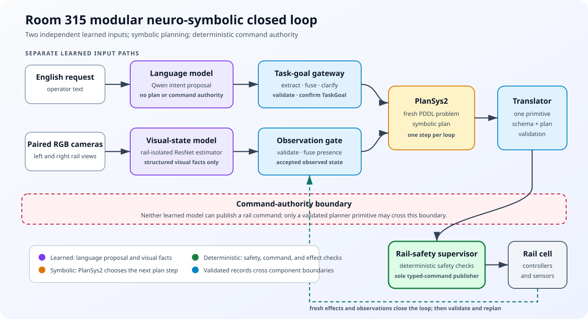

# Room 315 Visual-State Research

The current Room 315 research setup is a modular neuro-symbolic workflow, not a
learned vision-language-action policy. A visual-state model consumes paired
overhead RGB images and predicts structured visual facts; a separate language
model proposes task-goal fields. PlanSys2 produces symbolic plans, and the
deterministic rail-safety supervisor validates primitives and alone publishes
typed rail commands.

Expert-only rail state remains outside `model_input`. Binary sensors, exact
Gazebo pose, true shuttle segment, payload identity metadata, and validation
signals are kept in privileged metadata for audit and evaluation.

## Current Pipeline

```text
TaskGoal
  -> ObservedState / visual facts
  -> fused planner state
  -> PlanSys2 problem and plan
  -> one primitive command
  -> deterministic rail-safety supervisor
  -> execute, re-observe, verify, and replan
```



The two learned models feed validated records into later stages. Neither can
publish a rail command; command authority belongs to the deterministic
rail-safety supervisor.

The model-facing dataset mode is `visual_state`. Its model input contains only
declared overhead camera references. Oracle labels for shuttle bbox/location,
identity, loaded/empty state, visible switch state, obstacles, confidence, and
schema/calibration versions are stored separately for training and evaluation.

## Case Matrix

The active case matrix covers right and left rails, loaded shuttle selection,
nearest loaded shuttle selection, no-blocker moves, blocker clearance to a
stopper, and blocker clearance into the interior loop.

```text
mfja_robot_control_config/config/room_315_payload_cases/payload_training_cases_expanded_160_speed_sweep.yaml
```

## Evaluation

Evaluation should be run on successful payload-case episodes exported by:

```bash
ros2 run mfja_robot_control_config room_315_visual_training_event_extractor.py \
  ~/room315_payload_all_cases \
  --output meta/training_events.jsonl
```

The primary boundary to preserve is simple: visual models receive only declared
visual inputs and emit visual facts. Trusted device/simulator facts may be used
for safety, oracle fixtures, and evaluation, but they remain outside learned
inputs and outside learned outputs.
